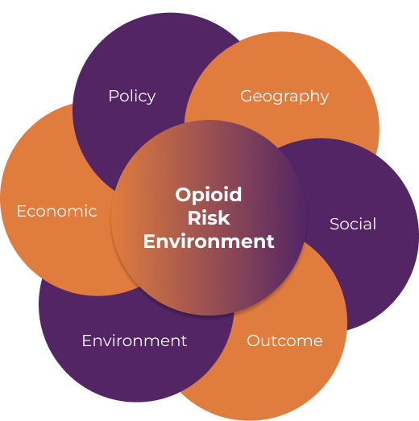
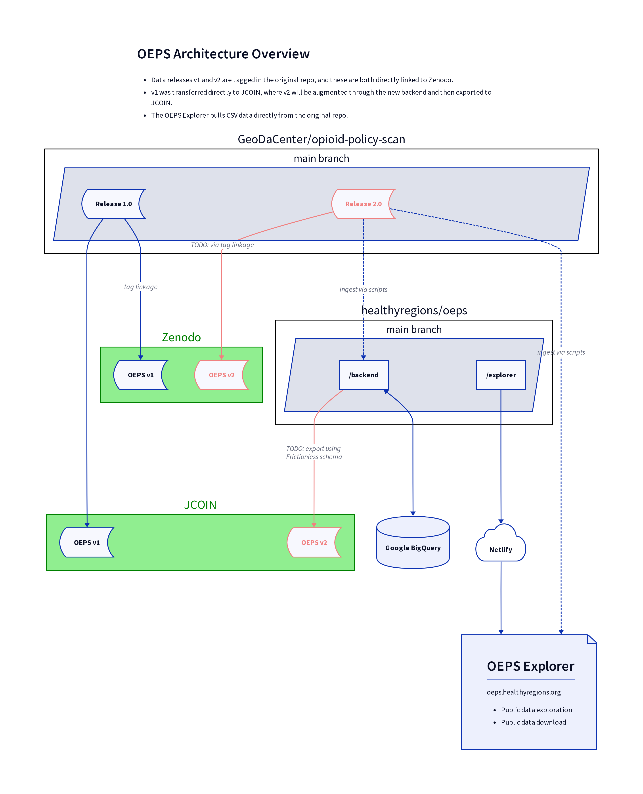

# Opioid Environment Policy Scan (OEPS)

The Opioid Environment Policy Scan (OEPS) is an open-source data warehouse that helps characterize helps characterize the multi-dimensional risk environment impacting opioid use and health outcomes across the United States.

This code base holds the following components of the OEPS project:

- OEPS Explorer (frontend): [oeps.healthyregions.org](https://oeps.healthyregions.org)
    - The OEPS Explorer is a NextJS app built from [WebGeoda](https://docs.webgeoda.org/) (which uses [jsGeoDa](https://jsgeoda.libgeoda.org/)) for geospatial interactivity.
- Data management backend
    - The backend is a Flask app that manages the many variables and datasets that makeup the OEPS data warehouse.
    - The backend uses [Frictionless Standards](https://specs.frictionlessdata.io) internally and features multiple export pipelines to different systems.

The [full documentation](./docs) describes how these applications interact, how to use them, and how to add new data variables and tables to the warehouse.

See also:

- [oepsData](https://oepsdata.healthyregions.org): An R data package wrapper around OEPS data
- [GeoDaCenter/opioid-policy-scan](https://github.com/GeoDaCenter/opioid-policy-scan): The original OEPS data repository (see [legacy-migration](./docs/legacy-migration.md) for more information about how this repository relates to that one)

## About OEPS

OEPS provides access to data at multiple spatial scales, from U.S. states down to Census tracts, as well different time periods, with data from 1980 to today. It is designed to support research seeking to study environments impacting and impacted by opioid use and opioid use disorder (OUD), inform public policy, and reduce harm in communities nationwide.

Variable constructs have been grouped thematically to highlight the multi-dimensional risk environment of opioid use in justice populations.  The variable themes are: **Geography, Social, Environment, Economic, Policy, Outcome,** and **Composite**.

## Credits

This project is led by the [Healthy Regions & Policies Lab](https://healthyregions.org) in the Department of Geography and GIScience at the University of Illinois, Urbana-Champaign.

### v1 Citation

Susan Paykin, Dylan Halpern, Qinyun Lin, Moksha Menghaney, Angela Li, Rachel Vigil, Margot Bolanos Gamez, Alexa Jin, Ally Muszynski, and Marynia Kolak. (2021). GeoDaCenter/opioid-policy-scan: Opioid Environment Policy Scan Data Warehouse (v1.0). Zenodo. http://doi.org/10.5281/zenodo.4747876

### v2 Citation

Adam Cox, Ashlynn Wimer, Sara Lambert, Susan Paykin, Dylan Halpern, Qinyun Lin, Moksha Menghaney, Angela Li, Rachel Vigil, Margot Bolanos Gamez, Alexa Jin, Ally Muszynski, and Marynia Kolak. (2024). healthyregions/oeps: Opioid Environment Policy Scan (OEPS) Data Warehouse (v2.0). Zenodo. https://doi.org/10.5281/zenodo.5842465

## Data Access and Release Architecture

