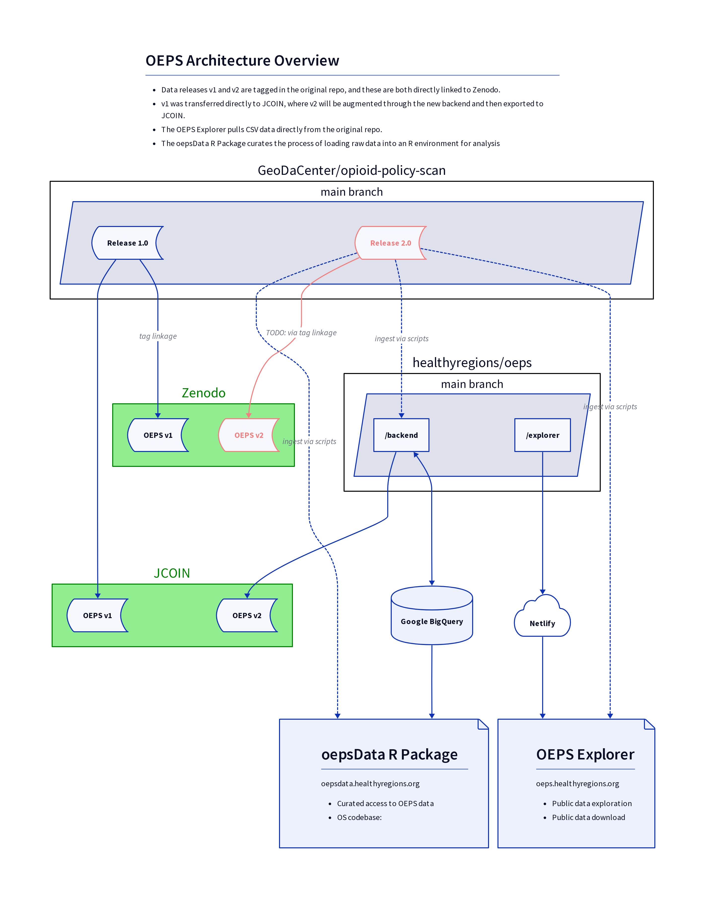

# Opioid Environment Policy Scan (OEPS)

This repo holds the OEPS explorer website, [oeps.healthyregions.org](https://oeps.healthyregions.org), as well as a backend system that handles integration with Google BigQuery.

- [explorer](./docs/explorer.md)
    - The OEPS Explorer is a NextJS app that uses WebGeoDa (built with [jsGeoDa](https://jsgeoda.libgeoda.org/)) for geospatial interactivity.
- [backend](./docs/backend.md)
    - The backend is a Flask application that uses [Frictionless Standards](https://specs.frictionlessdata.io) to load and query data in Google BigQuery. This application pulls from (but does not replace) the datasets stored in the pending v2 release of the original OEPS repo, [GeoDaCenter/opioid-policy-scan](https://github.com/GeoDaCenter/opioid-policy-scan).
- see also: [repo migration history](./docs/legacy-migration.md)
    - More information about the summer 2023 reorganization.

## About OEPS

The Opioid Environment Policy Scan (OEPS) is an open-source data warehouse that helps characterize helps characterize the multi-dimensional risk environment impacting opioid use and health outcomes across the United States. See [GeoDaCenter/opioid-policy-scan](https://github.com/GeoDaCenter/opioid-policy-scan) for more info.

The OEPS provides access to data at multiple spatial scales, from U.S. states down to Census tracts. It is designed to support research seeking to study environments impacting and impacted by opioid use and opioid use disorder (OUD), inform public policy, and reduce harm in communities nationwide. 

This repository stores scripts used to create the OEPS Explorer dashboard. We rely on [webgeoda scaffolding](http://dhalpern.gitbook.io/webgeoda-templatesBtw) to generate this dashboard. 

The OEPS Explorer lives at https://oeps.healthyregions.org/.

This project is led by the [Healthy Regions & Policies Lab](https://healthyregions.org) in the Department of Geography and GIScience at the University of Illinois, Urbana-Champaign.

## Data Overview

Variable constructs have been grouped thematically to highlight the multi-dimensional risk environment of opioid use in justice populations.  The variable themes are: **Geographic Boundaries, Policy, Health, Demographic, Economic, Physical Environment,** and **COVID-19**.

View the full Data Overview in the table [here](https://github.com/GeoDaCenter/opioid-policy-scan#data-overview).

## Data Access and Release Architecture

## Citation

### OEPS v1:

Susan Paykin, Dylan Halpern, Qinyun Lin, Moksha Menghaney, Angela Li, Rachel Vigil, Margot Bolanos Gamez, Alexa Jin, Ally Muszynski, and Marynia Kolak. (2021). GeoDaCenter/opioid-policy-scan: Opioid Environment Policy Scan Data Warehouse (v1.0). Zenodo. http://doi.org/10.5281/zenodo.4747876

## Contributing to this Repo

For contributions we'll use a standard branching pattern--make a new branch from `main`, add commits to it, and then create a pull request to get those changes merged back into `main`.

In the command line, this would look like the following steps. (VSCode and other editors have git integrations as well, but the steps are generally the same):

1. Make sure you are on the main branch locally

        git branch

2. Create a new branch from `main`

        git checkout -b your_new_branch_name

    You will now be on a new branch, as `git branch` will show you.

3. Change code, add commits

        git add path/to/your/new_file
        git commit -m "short description of the change you made"

    If you are addressing an open ticket with your commit, say ticket number 10, you should add `#10` to your commit message, like

        git commit -m "update file list for initialization #10"

4. Push your branch to the GitHub repo

        git push --set-upstream origin your_new_branch_name

5. Create the [Pull Request](https://github.com/healthyregions/pulls) in GitHub, including a description of the changes your branch contains.
