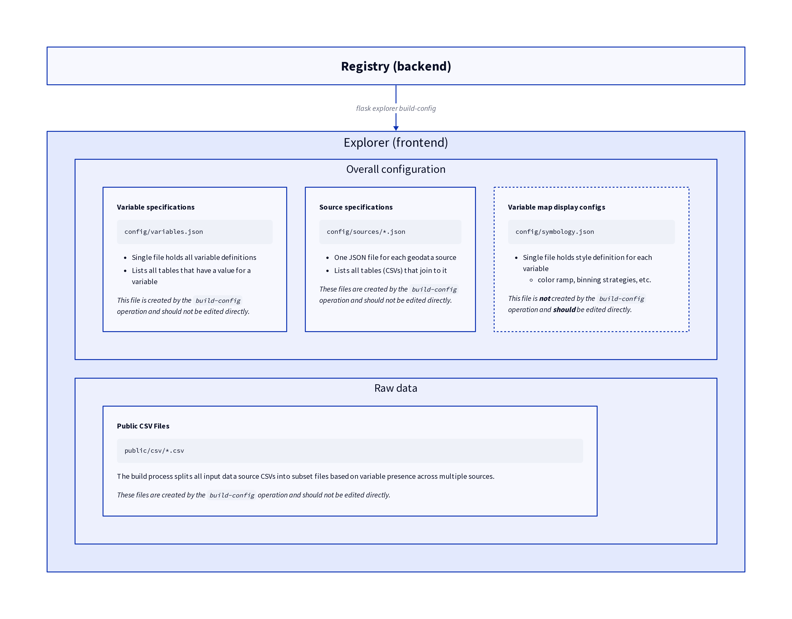

# OEPS Explorer

The OEPS Explorer is a NextJS app that built from [WebGeoDa Scaffolding](https://docs.webgeoda.org/), a configurable web map application that implements [jsGeoDa](https://jsgeoda.libgeoda.org/)) for geospatial interactivity.

## Install & Develop

To get started locally with the explorer:

```
git clone https://github.com/healthyregions/oeps
cd oeps/explorer
yarn install
cp .env.example .env
```

Some environment variable values will already be set in `.env`, but you'll need to add a Mapbox token. Then run

```
yarn dev
```

and open `http://localhost:3000`

### More about Mapbox dependencies

Two Mapbox Tilesets must be configured externally and linked within this app, one for Zip Code Tabulation Areas (ZCTAs) and one for Census Tracts. These geometries are joined with local CSV tables to drive map visualizations.

Additionally, a basemap style must be provided, as well as a Mapbox access token. All of these elements are (currently) provided through environment variables, so make sure your `.env` file has the following:

```
NEXT_PUBLIC_MAPBOX_TOKEN=<your token>
NEXT_PUBLIC_MAPBOX_STYLE="mapbox://styles/<account id>/<style id>'
```

## Data Configuration

The entire map interface is driven by a collection of files in the `config` directory. This content is (almost) all generated automatically from the backend, and should not be edited directly. This is because the number of variables we now have in the system has become very large (over 350). The one exception to this is the `config/symbology.json` file. In this file, we store map display configurations for each variable.

All of the actual data is stored in CSVs files located in `public/csv`.

