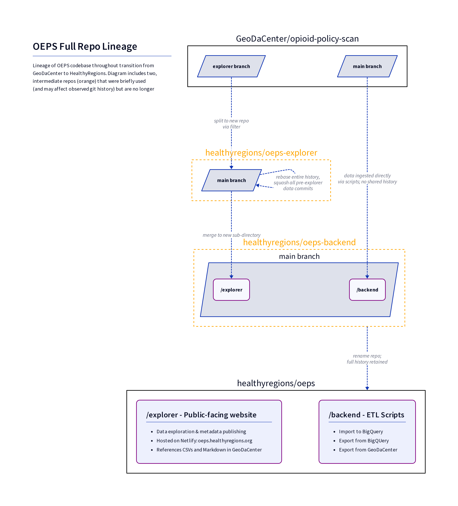

# Migration/Restructure 2023

Through the summer of 2023 we had two broad objectives:

1. undertake a significant data update for a v2 release
2. create a new backend integration with Google BigQuery

Furthermore, we needed to do some significant restructuring of the existing OEPS repositories in order to move management to our new [HealthyRegions](https://github.com/healthyregions) GitHub org. We tried our best to do this in a way that 

- retained existing release patterns and data stores, and
- retained past git history and record of individual contributions to OEPS

The end result is this single repo which holds the website (explorer) and new BQ backend, but still pulls from the original repo for static datasets which are pinned to that repo's GitHub release tags. Getting here was a bit circuitous, as you can see in the full diagram below.

