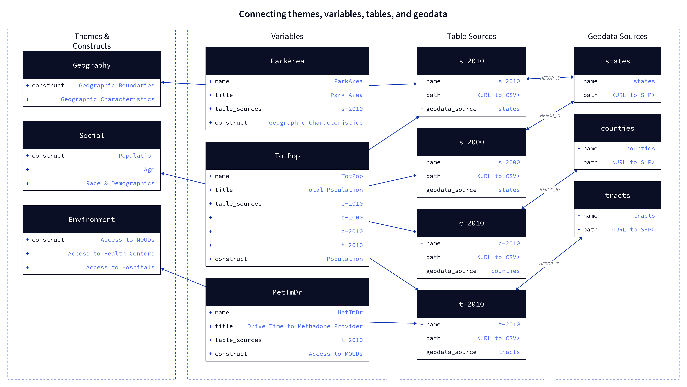

# Registry

The backend app includes a **registry** directory that holds a structured representation of *all* data within the OEPS warehouse. The registry serves as a central content hub from which all data export and transformation operations can be carried out, via CLI commands. The registry seeks to achieve the following:

- Reduce duplicative variable and source metadata representations
- Facilitate export to multiple configurations and formats, specifically
  - MS Excel Data Dictionaries (for general reference)
  - OEPS Explorer
  - JCOIN data commons
  - Google BigQuery
- Provide a framework for future addition of variables

The composition of the registry is largely inspired by [Frictionless](https://frictionlessdata.io/) data specs, which are used to generate [Data Packages](https://specs.frictionlessdata.io/data-package/), [Data Resources](https://specs.frictionlessdata.io/data-resource/), and other forms of data dictionaries and downloadable content.

The registry is broken into four parts:

- [themes & constructs](#themes-constructs)
- [variables](#variables)
- [table sources](#table-sources)
- [geodata sources](#geodata-sources)


## Rationale

The core rationale for this setup is to treat individual variables as the lowest common denominator within the system, allowing the concept of a variable to be shared across as many tables and data sources as needed. For example, "Total Population" is a variable that has a value in 16 different tables--by state in 2010, by county in 2010, by state in 2000, etc. The registry allows us to define this variable one time, and then link it with multiple data sources, each of which in turn links to the proper geospatial dataset.

Themes and constructs provide a mechanism through which variables can be organized within the risk environment framework, creating a thematic hierarchy without directly affecting the structure of the data or datasets themselves.

## Structure

The `variables.json` file holds a comprehensive lookup of *all* individual variables that are present in any source file, each defined by a suite of metadata properties that describe. One of these properties, `table_sources` is a list of ids for all table sources in which a value for this variable can be found.

Each table source (CSV) is in turn described by a JSON file in the `table_sources` directory, and linked via a `geodata_source` property to a similar entry in the `geodata_sources` directory. *All joins must be performed on the HEROP_ID field.*



The diagram above illustrates how three different example variables would be defined and connected to data sources. Only the necessary properties are shown for each item, but a detailed explanation of all properties can be found in the following sections.

To explain the example:

- **`ParkArea`** is a state level calculation (area of parks within a state) and it has only been calculated for 2010, so it is only stored in one table, called `s-2010` here.
- **`TotPop`** (total population) has a value in many different tables: at the state, county, and tract level in 2010 (`s-2010`, `c-2010`, and `t-2010`, respectively), as well as at the state level in 2000 (`s-2000`). As you can see, the `table_sources` field in `TotPop` lists all of these table ids.
- **`MetTmDr`** is the average drive time (in minutes) for how long it takes to access a methadone provider. This variable has only been calculated at the tract level, using 2010 data.

Though these three variables are present in four different data source tables, you will notice that these tables only link to three different geodata sources. This is because both of the state-level data sources, 2010 and 2000, can be joined to the same single `states` geodata source.

While this is a very small example (currently we have over 300 variables), it should be enough to illustrate the theoretical flexibility of the setup.

### `themes`

Themes are a very lightweight grouping of "constructs" that represent a variable (or a group of variables) at a conceptual level. Alongside each construct is a "proxy"; this is just a short description of all variables that fit within this construct. The structure of the `themes.json` file is very simple:

```json
{
  "<theme name>": {
    "<construct 1>": "<proxy for concept 1>",
    "<construct 2>": "<proxy for concept 2>",
  }
}
```

and with some real example values:

```json
{
  "Social": {
    "Age": "Age group estimates and percentages of population",
    "Race & Ethnicity": "Percentages of population defined by categories of race and ethnicity",
  }
}
```

Each variable is matched to one construct via its `construct` propert (see below).

Themes, construct, and proxies are only used in certain export formats, and are not a structurally central aspect of the registry.

### `variables`

A single file, `variable.json`, serves as a central lookup for all variables, each one being defined as a Frictionless [Field Descriptor](https://specs.frictionlessdata.io/table-schema/#field-descriptors), with some extra properties that we have added for our own needs. The key for each item in the lookup must be the same as its `name` property.

- `name` - Canonical name of the variable, same as key for this item, must be CamelCase and &lt;= 10 characters long.
- `title` - Human-readable title.
- `type` - The type of data in this column, must be one of Frictionless [field types](https://specs.frictionlessdata.io/table-schema/#types-and-formats).
- `example` - An example value in this field.
- `description` - A one or two sentence description.
- `constraints` - Any data usage constraints that are relevant for this variable.
- `comments` - Any extra comments about this variable's creation that don't fit into other properties.
- `construct` - A "construct" string that is present within the `themes.json` file (see above)
- `source` - Creator of this variable, abbreviations ok.
- `source_long` - Long-form version of source
- `oeps_v1_table` - If applicable, the name of the data table that this variable was stored in in OEPS v1.
- `metadata_doc_url` - URL to raw content for a Markdown-formatted metadata document (this content is read and loaded directly into the explorer webpages).
- `longitudinal` - `true`/`false`, appropriate for longitudinal comparison.
- `analysis` - `true`/`false`
- `table_sources` - A list of data_source identifiers, must match identiers in the `sources.json` file.

<summary>
  <strong>Full Example</strong> (<code>TotPop</code>):
  <details>
  <pre>
  "TotPop": {
      "name": "TotPop",
      "title": "Total Population",
      "type": "number",
      "example": "1632480",
      "description": "Total population",
      "constraints": "1980-2000 historic data was acquired from NHGIS and then interpolated to modern county boundaries through a population weighted interpolation using the tidycensus `interpolate_pw` function. For 1980, the underlying population weighting was county subdivisions, while for 1990 and 200 the underlying population weighting was tracts.",
      "construct": "Population",
      "source": "ACS 2018, 5-Year; Census 2010; IPUMS NHGIS",
      "source_long": "American Community Survey 2014-2018 5 Year Estimate; 2010 Decennial Census; Integrated Public Use Microdata Series National Historic Geographic Information System",
      "oeps_v1_table": null,
      "comments": "For more information about how these data have been used in homelessness and housing stability research, please refer to https://www.census.gov/newsroom/press-releases/2020/special-operations-homelessness.html or https://www.americanprogress.org/issues/poverty/reports/2020/10/05/491122/count-people-where-they-are/.",
      "metadata_doc_url": "https://github.com/GeoDaCenter/opioid-policy-scan/blob/main/data_final/metadata/Age_2018.md",
      "longitudinal": true,
      "analysis": false,
      "table_sources": [
        "c-1980",
        "s-latest",
        "t-2010",
        "t-latest",
        "s-2000",
        "t-2000",
        "c-1990",
        "z-latest",
        "t-1990",
        "s-1980",
        "c-latest",
        "s-1990",
        "s-2010",
        "t-1980",
        "c-2010",
        "c-2000"
    ]
  },
  </pre>
</details></summary>

### `table_sources`

Each table source file is essentially a [Tabular Data Resource](https://specs.frictionlessdata.io/tabular-data-resource/) that links to a single data table (CSV), but without a `schema` property. Where the `schema` typically defines a primary key, foreign key (for joins), and a list of all fields, all of this information is inferred or standardized elsewhere and need not be stored in these files.

There are a few rules for how a CSV can be constructed:

1. It must have a `HEROP_ID` column that joins each row to a geography unit.
2. It must only have data for a single geography category within it.
3. *Ideally* it will only have values for a single publication year (though we don't yet have this enforced).

#### Example

```json
{
    "name": "c-1980",
    "path": "https://raw.githubusercontent.com/GeoDaCenter/opioid-policy-scan/main/data_final/full_tables/C_1980.csv",
    "title": "OEPS Data Aggregated by Census Tract (1980)",
    "description": "This CSV aggregates all 1980 data variables from the OEPS v2 release at the Census Tract level.",
    "bq_dataset_name": "tabular",
    "bq_table_name": "C_1980",
}
```

- `name` - Identifier for this table source. This ID is referenced by entries in the variables file.
- `path` - URL to publicly hosted CSV file.
- `title` - Human reaadable title of this source.
- `description` - A short, informative description of the data source.
- `bq_dataset_name` - The "dataset" (i.e. database) name in BigQuery that this source will be loaded into.
- `bq_table_name` - The table name that this dataset will be loaded into.

### `geodata_sources`

This directory holds Frictionless [Data Resource](https://specs.frictionlessdata.io/data-resource/) definitions of shapefiles, that are used as base data for all joins. There are 4 different geographies--States, Counties, Tracts, and Zip Code Tabulation Areas (ZCTAs)--and (currently) all but the ZCTAs have data for both 2010 and 2018.

Each shapefile must have, at least, a `HEROP_ID` field which will be used by all CSV files for joins.
