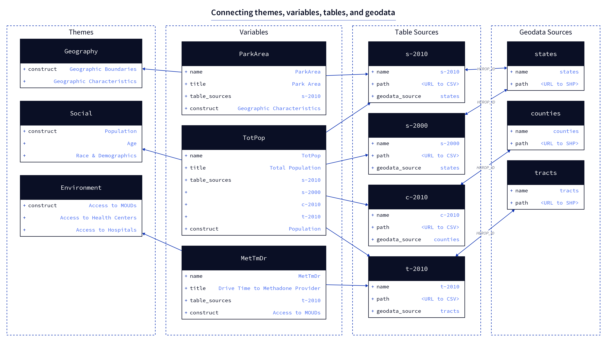

# Registry

The backend app includes a **registry** directory that holds a structured representation of *all* data within the OEPS warehouse. The registry serves as a central content hub from which all data export and transformation operations can be carried out, via CLI commands. The registry seeks to achieve the following:

- Reduce duplicative variable and source metadata representations
- Facilitate export to multiple configurations and formats, specifically
  - OEPS Explorer
  - JCOIN data commons
  - Google BigQuery
- Provide a framework for future addition of variables

The composition of the registry is largely inspired by [Frictionless](https://frictionlessdata.io/) data specs, which are used to generate [Data Packages](https://specs.frictionlessdata.io/data-package/), [Data Resources](https://specs.frictionlessdata.io/data-resource/), and other forms of data dictionaries and downloadable content.

The registry is broken into three parts:

- [variables.json](#variablesjson)
- [variable_sources](#variable-sources)
- [geodata_sources](#geodata-sources)


## Rationale

The core rationale for this setup is to treat individual variables as the lowest common denominator within the system, allowing the concept of a variable to be shared across as many tables and data sources as needed. For example, "Total Population" is a variable that has a value in 16 different tables--by state in 2010, by county in 2010, by state in 2000, etc. The registry allows us to define this variable one time, and then link it with multiple data sources, each of which in turn links to the proper geospatial dataset.

## Structure

The `variables.json` file holds a comprehensive lookup of *all* individual variables that are present in any source file, each defined by a suite of metadata properties that describe. One of these properties, `data_sources` is a list of ids for all data sources in which a value for this variable can be found.

Each source table (CSV) that holds data is described by its own JSON file in the `variables_sources` directory. These JSON definitions follow the [Data Resource spec](https://specs.frictionlessdata.io/data-resource/), with one important difference: All `fields` lists are empty. Where traditionally the `fields` list would have a definition of each field, "fields" are what we are calling "variables", so this list is populated at "run-time" (by whatever operation is interrogating the files) based on the `data_sources` property of each variable.

Spatial data to which each data source must be joined is defined in the `geodata_sources` directory. *All joins must be performed on the HEROP_ID field.*



The diagram above illustrates how three different example variables would be defined and connected to data sources. Only the necessary properties are shown for each item, but a detailed explanation of all properties can be found in the following sections.

To explain the example:

- **`ParkArea`** is a state level calculation (area of parks within a state) and it has only been calculated for 2010, so it is only stored in one table, called `s-2010` here.
- **`TotPop`** (total population) has a value in many different tables: at the state, county, and tract level in 2010 (`s-2010`, `c-2010`, and `t-2010`, respectively), as well as at the state level in 2000 (`s-2000`). As you can see, the `data_sources` field in `TotPop` lists all of these table ids.
- **`MetTmDr`** is the average drive time (in minutes) for how long it takes to access a methadone provider. This variable has only been calculated at the tract level, using 2010 data.

Though these three variables are present in four different data source tables, you will notice that these tables only link to three different geodata sources. This is because both of the state-level data sources, 2010 and 2000, can be joined to the same single `states` geodata source.

While this is a very small example (currently we have well over 350 variables), it should be enough to show the flexibility of the system.

### `variables.json`

This file is a lookup for all variables, each one being defined as a Frictionless [Field Descriptor](https://specs.frictionlessdata.io/table-schema/#field-descriptors), with some extra properties that we have added for our own needs. The key for each field in the lookup must be the same as its `name` property, which must be CamelCase and &lt;= 10 characters long.

- `name` - Canonical name of the variable. Same as identifier above.
- `title` * - Human-readable title.
- `type` * - The type of data in this column, must be one of Frictionless [field types](https://specs.frictionlessdata.io/table-schema/#types-and-formats).
- `example` * - An example value in this field.
- `description` * - A one or two sentence description.
- `constraints` * - Any data usage constraints that are relevant for this variable.
- `comments` - Any extra comments about this variable's creation that don't fit into other properties.
- `src_name` - The name of this column in its data sources (this _should_ be the same as name above anyway).
- `bq_data_type` - The type of column that this variable will be placed into in BigQuery, must be one of [these types](https://cloud.google.com/bigquery/docs/reference/standard-sql/data-types).
- `theme` - One of: _Social_, _Economic_, _Policy_, _Physical Environment_, _Outcome_
- `source` - Creator of this variable, abbreviations ok.
- `source_long` - Long-form version of source
- `oeps_v1_table` - If applicable, the name of the data table that this variable was stored in in OEPS v1.
- `metadata_doc_url` - URL to raw content for a Markdown-formatted metadata document (this content is read and loaded directly into the explorer webpages).
- `longitudinal` - `true`/`false`, appropriate for longitudinal comparison.
- `analysis` - `true`/`false`
- `data_sources` - A list of data_source identifiers, must match identiers in the `sources.json` file.

<summary>
  See full example, <code>TotPop</code>
  <details>
  <pre>
  "TotPop": {
      "name": "TotPop",
      "title": "Total Population",
      "src_name": "TotPop",
      "type": "number",
      "example": "1632480",
      "description": "Total population",
      "constraints": "1980-2000 historic data was acquired from NHGIS and then interpolated to modern county boundaries through a population weighted interpolation using the tidycensus `interpolate_pw` function. For 1980, the underlying population weighting was county subdivisions, while for 1990 and 200 the underlying population weighting was tracts.",
      "theme": "Social",
      "source": "ACS 2018, 5-Year; Census 2010; IPUMS NHGIS",
      "source_long": "American Community Survey 2014-2018 5 Year Estimate; 2010 Decennial Census; Integrated Public Use Microdata Series National Historic Geographic Information System",
      "oeps_v1_table": null,
      "comments": "For more information about how these data have been used in homelessness and housing stability research, please refer to https://www.census.gov/newsroom/press-releases/2020/special-operations-homelessness.html or https://www.americanprogress.org/issues/poverty/reports/2020/10/05/491122/count-people-where-they-are/.",
      "bq_data_type": "FLOAT",
      "metadata_doc_url": "https://github.com/GeoDaCenter/opioid-policy-scan/blob/main/data_final/metadata/Age_2018.md",
      "longitudinal": true,
      "analysis": false,
      "data_sources": [
        "c-1980",
        "s-latest",
        "t-2010",
        "t-latest",
        "s-2000",
        "t-2000",
        "c-1990",
        "z-latest",
        "t-1990",
        "s-1980",
        "c-latest",
        "s-1990",
        "s-2010",
        "t-1980",
        "c-2010",
        "c-2000"
    ]
  },
  </pre>
</details></summary>

### `data_sources`

Each variable source file is a [Tabular Data Resource](https://specs.frictionlessdata.io/tabular-data-resource/) that links to a single data table (CSV). However, while a typical data resource would have a list of `fields` that reflect the columns in the CSV, that field should always be empty because a variable's presence in a CSV will be indicated by adding the source's `name` to the variable's entry in the single `variables.json` registry.

There are a few rules for how a CSV can be constructed:

1. It must have a `HEROP_ID` column that joins each row to a geography unit.
2. It must only have data for a single geography category within it.
3. It must only have variables in it that correspond to a single publication year.

Incoming CSVs that hold a variable's value across multiple years must be split into separate files, each will be defined separately as a data source.

#### Example

```json
"c-1980": {
    "name": "c-1980",
    "path": "https://raw.githubusercontent.com/GeoDaCenter/opioid-policy-scan/main/data_final/full_tables/C_1980.csv",
    "title": "OEPS Data Aggregated by Census Tract (1980)",
    "description": "This CSV aggregates all 1980 data variables from the OEPS v2 release at the Census Tract level.",
    "year": "1980",
    "geography": "county",
    "bq_dataset_name": "tabular",
    "bq_table_name": "C_1980",
}
```

- `c-1980` - This is the identifier for the source, and is referenced in the variables file below. It can be any string value (no spaces though!)
- `name` - Name of the source. Same as identifier above.
- `path` - URL to publicly hosted CSV file.
- `title` - Human reaadable title of this source.
- `description` - A short, informative description of the data source.
- `year`- The year of the data variables in this source (ideally they are all the same year).
- `geography` - The geography that these variable values correspond to.
- `bq_dataset_name` - The "dataset" (i.e. database) name in BigQuery that this source will be loaded into.
- `bq_table_name` - The table name that this dataset will be loaded into.

### `geo_sources`

This directory holds Frictionless [Data Resource](https://specs.frictionlessdata.io/data-resource/) definitions of shapefiles, that are used as base data for all joins. There are 4 different geographies--States, Counties, Tracts, and Zip Code Tabulation Areas (ZCTAs)--and (currently) all but the ZCTAs have data for both 2010 and 2018.

Each shapefile must have, at least, a `HEROP_ID` field which will be used by all CSV files for joins.
