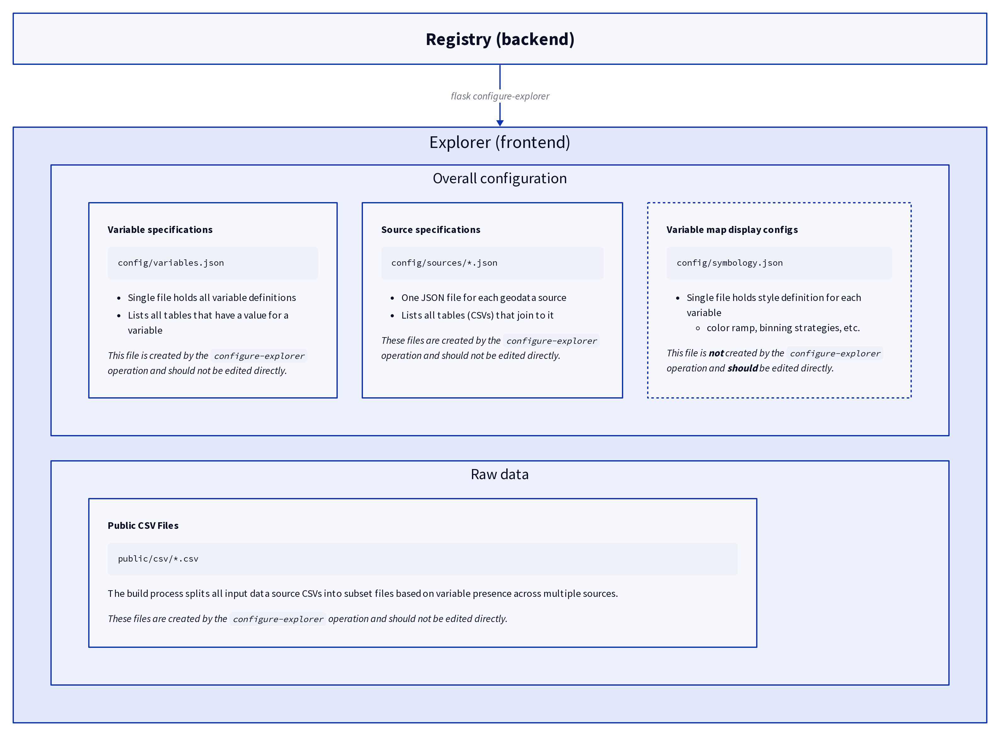

# Provisioning OEPS Explorer

The data that drives the OEPS Explorer is generated through commands run in the backend app.

## Interactive Map

To regenerate the data that is displayed on the OEPS interactive web map, use the following:

```shell
flask build-explorer-map
```

!!! tip ""
    [view in cli reference &rarr;](../cli-reference/build-explorer-map.md)

CSV content will be restructured and written to a directory that the frontend OEPS Explorer can read. The `variables.json` file within the OEPS Explorer will be updated as well, pointing to the newly uploaded files.

Run with `--upload` to put the output in S3. You must do this to publish changes to the production site.

The entire map interface is driven by a collection of files in the `config` directory. This content is (almost) all generated automatically from the backend, and should not be edited directly. This is because the number of variables we now have in the system has become very large (over 350). The one exception to this is the `config/symbology.json` file. In this file, we store map display configurations for each variable.

All of the actual data is stored in CSVs files located in `public/csv`.



## Docs

The [/docs](https://oeps.healthyregions.org/docs) page is driven by a generated set of JSON files that link themes, constructs, and variable-specific information. Generate this content with:

```shell
flask build-explorer-docs
```

!!! tip ""
    [view in cli reference &rarr;](../cli-reference/build-explorer-docs.md)
