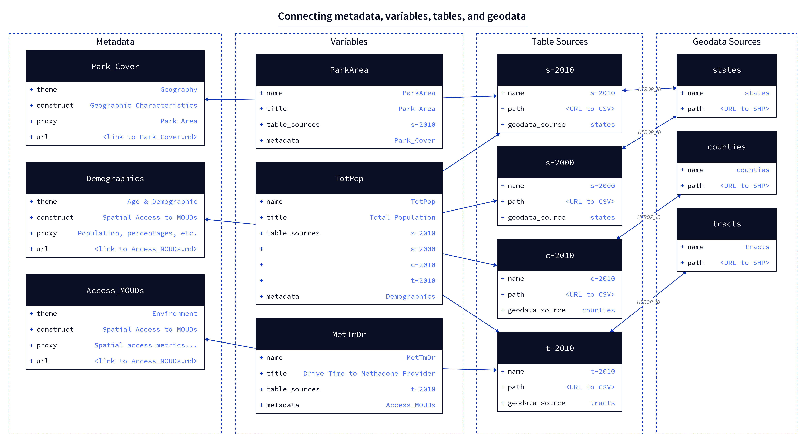

# Overview

## Rationale

The backend app includes a **registry** directory that holds a structured representation of *all* data within the OEPS warehouse. The registry serves as a central content hub from which all data export and transformation operations can be carried out, via CLI commands. The registry seeks to achieve the following:

- Reduce duplicative variable and source metadata representations
- Facilitate export to multiple configurations and formats, specifically
- Provide a framework for future addition of variables

The composition of the registry is largely inspired by [Frictionless](https://frictionlessdata.io/) data specs, which are used to generate [Data Packages](https://specs.frictionlessdata.io/data-package/), [Data Resources](https://specs.frictionlessdata.io/data-resource/), and other forms of data dictionaries and downloadable content.

The registry is broken into four parts:

- [themes & constructs](./themes-constructs.md)
- [variables](./variables.md)
- [table sources](./table-sources.md)
- [geodata sources](./geodata-sources.md)

The core rationale for this setup is to treat individual variables as the lowest common denominator within the system, allowing the concept of a variable to be shared across as many tables and data sources as needed. For example, "Total Population" is a variable that has a value in 16 different tables--by state in 2010, by county in 2010, by state in 2000, etc. The registry allows us to define this variable one time, and then link it with multiple data sources, each of which in turn links to the proper geospatial dataset.

Themes and constructs provide a mechanism through which variables can be organized within the risk environment framework, creating a thematic hierarchy without directly affecting the structure of the data or datasets themselves.

## Structure

The `variables.json` file holds a comprehensive lookup of *all* individual variables that are present in any source file, each defined by a suite of metadata properties that describe. One of these properties, `table_sources` is a list of ids for all table sources in which a value for this variable can be found.

Each table source (CSV) is in turn described by a JSON file in the `table_sources` directory, and linked via a `geodata_source` property to a similar entry in the `geodata_sources` directory. *All joins must be performed on the HEROP_ID field.*

The diagram above illustrates how three different example variables would be defined and connected to data sources. Only the necessary properties are shown for each item, but a detailed explanation of all properties can be found in the following sections.

To explain the example:

- **`ParkArea`** is a state level calculation (area of parks within a state) and it has only been calculated for 2010, so it is only stored in one table, called `s-2010` here.
- **`TotPop`** (total population) has a value in many different tables: at the state, county, and tract level in 2010 (`s-2010`, `c-2010`, and `t-2010`, respectively), as well as at the state level in 2000 (`s-2000`). As you can see, the `table_sources` field in `TotPop` lists all of these table ids.
- **`MetTmDr`** is the average drive time (in minutes) for how long it takes to access a methadone provider. This variable has only been calculated at the tract level, using 2010 data.

Though these three variables are present in four different data source tables, you will notice that these tables only link to three different geodata sources. This is because both of the state-level data sources, 2010 and 2000, can be joined to the same single `states` geodata source.

While this is a very small example (currently we have over 300 variables), it should be enough to illustrate the theoretical flexibility of the setup.
