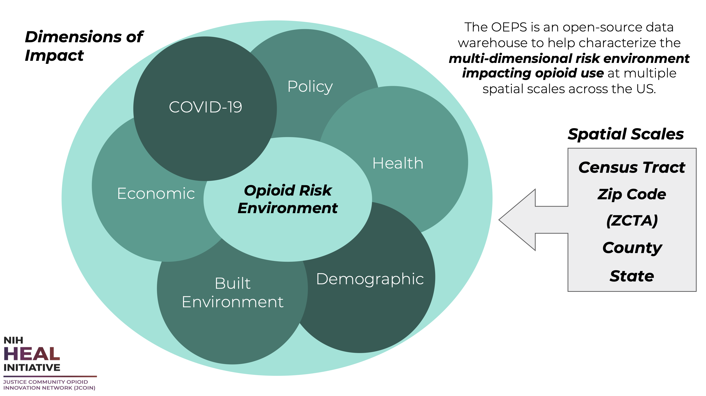

<<<<<<< HEAD
# oeps-backend

This project builds from the Opioid Environment Policy Scan (OEPS) data warehouse stored in [github.com/GeoDaCenter/opioid-policy-scan](https://github.com/GeoDaCenter/opioid-policy-scan), and published on Zenodo at [doi.org/10.5281/zenodo.5842465](https://doi.org/10.5281/zenodo.5842465). This repo allows us to pull the final data from the latest OEPS release and push it into Google BigQuery, which will enable new ways of accessing and analyzing that data.

## Getting Started

### Install the Python Package

0. Create and activate a [Python virtual environment](https://realpython.com/python-virtual-environments-a-primer/) with [venv](https://docs.python.org/3/library/venv.html), [Conda](https://docs.conda.io/projects/conda/en/latest/user-guide/install/index.html), or your other tool of choice.

1. Clone this repo

        git clone https://github.com/healthyregions/oeps-backend
        cd oeps-backend

2. Install this package and its dependencies

        pip install -e .

3. Enter the `oeps_backend` directory, this is where you'll run scripts from.

        cd oeps_backend

### Setup BigQuery Credentials

Enviroment variables allow us to keep BigQuery credentials outside of version control.

- Make a copy of `.env.example` and name it `.env`. Any variables defined in this file will now be available via `os.getenv('VARIABLE_NAME')`

- Obtain a set of JSON credentials for the project, and store the file anywhere on your computer (but outside of this repository).

- In your `.env` file, update the `BQ_CREDENTIALS_FILE_PATH` variable with the full path to this file.

    ```
    BQ_CREDENTIALS_FILE_PATH="/home/my_username/bq_credentials/oeps-391119-5783b2b59b83.json"
    ```

- It is also possible to set BigQuery credentials without storing a local JSON file. More info on this is in the `.env.example`.

## BigQuery Import/Export

### Importing Data

Use the following command to load a new table into BigQuery:

    python bq_load.py table_definitions/table.json

Where `table.json` is a [table definition file](#table-definitions). Optional flags on this command are:

- `--table-only` will create the BQ dataset and table, but will not attempt to load data into it.
- `--dry-run` will validate the input dataset against the table definition, but not attempt to load it.
- `--overwrite` will drop and recreate the BQ table if it already exists in the dataset.


### Exporting Data

Use the following command to query the OEPS BigQuery tables:

    python bq_query.py --sql sql/states.sql --output states.shp

Where `states.sql` is an example of a file that holds the SQL query to perform against one or more tables. In the SQL, `PROJECT_ID` is a placeholder (it will be replaced with the actual project identifier before the query is performed), such that table references look like `PROJECT_ID.dataset_name.table_name`, or `PROJECT_ID.spatial.states2018` for the table that holds state boundaries.

- `--sql-file` path to a file whose contents is a complete SQL query. 
- `--output` is the name of a file to which the query results will be written. Either .csv or .shp files can be specified, and if a spatial result is written to CSV the geometries will be in WKT format. If this argument is omitted, the query results will be printed to the console (helpful for testing queries).

You can write your own SQL into a file and use the same command to perform your query and export the results.

Use the [BQ-Reference](BQ-Reference.md) page for quick access to all table and column names.

### Table Definitions

A **table definition** is a JSON file that specifies

1. The location of a source dataset to load
2. The Google BigQuery project and table name to load into
3. A thorough schema defining all fields from the source dataset and how they will be stored in BigQuery

This information is used in various contexts to

1. Create (or re-create) table schemas in BigQuery
2. Load data into these tables
3. Export data from BigQuery into various formats and file types

The structure of a table definition is inspired by the [Table Schema](https://specs.frictionlessdata.io/table-schema) specification published by [Frictionless Standards](https://specs.frictionlessdata.io), with a few additions for our own use case.

#### Structure

The top-level properties of a table definition are:

Property|Format|Description
-|-|-
`data_source`|String|Path or URL for CSV or SHP dataset to load
`bq_table_name`|String|Target table in BigQuery
`bq_dataset_name`|String|Target dataset in BigQuery
`fields`|List|List of definitions for all table fields

Note that in BigQuery, a `dataset` is akin to a database in other RDBS implementations, such that a dataset holds one or more tables. Often, tables are identified by their fully-qualified identifier: `project_id.dataset_name.table_name`.

The `fields` property is a list of one or more field objects, as described below. The only requirement of the `fields` list is that **must** contain an entry for a [`HEROP_ID`](#herop_id-field) field. This is our unique GIS join field.

#### Field Descriptors

Fields are defined by a JSON object that adheres to the [field descriptors](https://specs.frictionlessdata.io/table-schema/#field-descriptors) portion of the table schema standard, though not all possible attributes are required or implemented.

Property|Format|Description|OEPS Use
-|-|-|-
`name`|String|Canonical name for this column (used in BigQuery)|Required
`title`|String|A nicer human readable label or title for the field|Required
`type`|String|A string specifying the type. See [types](https://specs.frictionlessdata.io/table-schema/#types-and-formats).|Required
`format`|String|A string specifying a format|Not Implemented
`example`|String|An example value for the field|Optional
`description`|String|A description for the field|Optional
`constraints`|JSON|A [constraints descriptor](https://specs.frictionlessdata.io/table-schema/#constraints)|Not Implemented

The following additional attributes are also supported and in some cases required:

Property|Format|Description|OEPS Use
-|-|-|-
`src_name`|String|Name of column in source dataset|Required
`bq_data_type`|String|[Field type for BigQuery schema](https://cloud.google.com/bigquery/docs/reference/rest/v2/tables#TableFieldSchema.FIELDS.type)|Required
`theme`|String|One of `Social`, `Environment`, `Economic`, `Policy`, `Outcome`, or `Geography`. See [OEPS docs](https://oeps.healthyregions.org/docs).|Optional
`comment`|String|Additional information about the data in this field|Optional
`source`|String|Source of the data in this field|Optional
`max_length`|Integer|Max length of field (used in BigQuery schema)|Optional

#### HEROP_ID Field

For now, please see [this comment](https://github.com/GeoDaCenter/opioid-policy-scan/issues/68#issuecomment-1701863572) for a detailed description of how `HEROP_ID` values are constructed.

A field descriptor for this field will look something like this:

```
{
    "name": "HEROP_ID",
    "src_name": "HEROP_ID",
    "type": "string",
    "example": "040US01-2018",
    "description": "A derived unique id corresponding to the relevant geographic unit.",
    "theme": "Geography",
    "bq_data_type": "STRING"
}
```

#### Geometry Fields

To load a shapefile you must include the following field descriptor in your `fields` list:

```
{
    "name": "geom",
    "title": "Geom",
    "type": "string",
    "src_name": "geometry",
    "bq_data_type": "GEOGRAPHY"
}
```

Note that for spatial data Table Schema only allows `geojson` or `geopoint` as valid geographic types, while Google BigQuery uses `GEOGRAPHY`. For now, we'll just use the above configuration, and more nuances can be pursued down the road. 

#### Example

The following is a truncated version of a table definition for the 2010 State-level data published in OEPS v2.0. This defines a table `project_id.tabular.S_2010` with two fields, `HEROP_ID` and `TotPop`. Note also the direct URL to the raw `data_source` on GitHub.

```
{
    "bq_dataset_name": "tabular",
    "bq_table_name": "S_2010",
    "data_source": "https://raw.githubusercontent.com/GeoDaCenter/opioid-policy-scan/main/data_final/full_tables/S_2010.csv",
    "fields": [
        {
            "name": "HEROP_ID",
            "src_name": "HEROP_ID",
            "type": "string",
            "description": "A derived unique id corresponding to the relevant geographic unit.",
            "constraints": null,
            "theme": "Geography",
            "bq_data_type": "STRING"
        },
        {
            "name": "TotPop",
            "src_name": "TotPop",
            "type": "integer",
            "example": "7294336",
            "description": "Estimated total population",
            "constraints": null,
            "theme": "Social",
            "source": "American Community Survey 2014-2018 5 Year Estimates; 2010 Decennial Census; Integrated Public Use Microdata Service National Historic Geographic Information Systems",
            "comments": "1980, 1990, and 2000 data from respective decennial censuses downloaded from IPUMS NHGIS and aggregated upwards.",
            "bq_data_type": "INTEGER"
        }
    ]
}
```

## Contributing to this Repo

For contributions we'll use a standard branching pattern--make a new branch from `main`, add commits to it, and then create a pull request to get those changes merged back into `main`.

In the command line, this would look like the following steps. (VSCode and other editors have great git integrations as well, but the steps are generally the same):

1. Make sure you are on the main branch locally

        git branch

2. Create a new branch from `main`

        git checkout -b your_new_branch_name

    You will now be on a new branch, as `git branch` will show you.

3. Change code, add commits

        git add path/to/your/new_file
        git commit -m "short description of the change you made"

    If you are addressing an open ticket with your commit, say ticket number 10, you should add `#10` to your commit message, like

        git commit -m "update file list for initialization #10"

4. Push your branch to the GitHub repo

        git push --set-upstream origin your_new_branch_name

5. Create the [Pull Request](https://github.com/healthyregions/pulls) in GitHub, including a description of the changes your branch contains.

<!-- README.md is generated from README.Rmd. Please edit that file -->

# Opioid Environment Policy Scan (OEPS) Database

## Public Site - OEPS Explorer
Explore, download, and map OEPS data on the [OEPS Explorer](https://oeps.netlify.app/). 
# OEPS-dashboard
*Updated August 2021*
=======
# OEPS Explorer
*Updated January 2022*
>>>>>>> Update README.md

## About

The Opioid Environment Policy Scan (OEPS) is an open-source data warehouse that helps characterize helps characterize the multi-dimensional risk environment impacting opioid use and health outcomes across the United States. See [GeoDaCenter/opioid-policy-scan](https://github.com/GeoDaCenter/opioid-policy-scan) for more info.

The OEPS provides access to data at multiple spatial scales, from U.S. states down to Census tracts. It is designed to support research seeking to study environments impacting and impacted by opioid use and opioid use disorder (OUD), inform public policy, and reduce harm in communities nationwide. 

This repository stores scripts used to create the OEPS Explorer dashboard. We rely on [webgeoda scaffolding](http://dhalpern.gitbook.io/webgeoda-templatesBtw) to generate this dashboard. 

The OEPS Explorer lives at https://oeps.healthyregions.org/.

This project is led by the Healthy Regions & Policies Lab at the Center for Spatial Data Science, University of Chicago. 

### Citation
Susan Paykin, Dylan Halpern, Qinyun Lin, Moksha Menghaney, Angela Li, Rachel Vigil, Margot Bolanos Gamez, Alexa Jin, Ally Muszynski, and Marynia Kolak. (2021). GeoDaCenter/opioid-policy-scan: Opioid Environment Policy Scan Data Warehouse (v1.0). Zenodo. http://doi.org/10.5281/zenodo.4747876

## Data Overview



Variable constructs have been grouped thematically to highlight the multi-dimensional risk environment of opioid use in justice populations.  The variable themes are: **Geographic Boundaries, Policy, Health, Demographic, Economic, Physical Environment,** and **COVID-19**.

View the full Data Overview in the table [here](https://github.com/GeoDaCenter/opioid-policy-scan#data-overview). 

## WebGeoDa Scaffolding


WebGeoDa Scaffolding is a set of easy-to-use frontend JavaScript toolkits to get started building and exploring client-side geospatial analytics.

⚠️ Heads up! This repository is an _unstable_ work in progress. This means a lot will change in future releases. ⚠️

## About Webgeoda Scaffolding

**What is this thing?**

WebGeoDa is a set of tools, templates, and scaffolding to quickly and easily develop geospatial data dashboards. WebGeoDa builds on the GeoDa suite of geospatial software and extends jsGeoDa through accessible and ready-to-go examples. WebGeoDa uses  [jsGeoDa](https://jsgeoda.libgeoda.org/) (Xun Li & Luc Anselin) as the core of it's geospatial engine, alongside a collection of modern and high-performance libraries for mapping, analysis, data handling, and UI matters.

WebGeoDa capabilities have four areas of complexity. It's easy to learn, but with a high ceiling for customization:

‍💻 Add your geospatial data (GeoJSON), join it to your tabular data (CSV) right in the browser. Specify your variables with a simple JSON specification, and your map is ready to be published!

📑 Customize and add static pages to describe your data and the context of your dashboard. WebGeoDa provides some Physical-in styling tools using Plain CSS and a reasonably approachable JSX, similar to HTML.

🗺 Add additional map features using Mapbox and Deck.gl, or explore additional data insights through interactive tooltip and sidebar functions.

🦺 Dive directly into the WebGeoDa scaffolding with full control over custom react hooks, the jsGeoDa WebAssembly + WebWorker geospatial engine, a fast Redux-backed state, and extensible and accessible components. 

## What can WebGeoDa do?

WebGeoDa focuses on enabling exploratory data dashboards with complex data, the need for diverse variables, and high performance in-browser analytics. You can make maps with a variety of color-binning techniques and spatial statistical methods, like Hotspot cluster analysis, through a simple JSON based data and variable configuration.

## See the [full docs](https://dhalpern.gitbook.io/webgeoda-templates/) for more and [get started here](https://dhalpern.gitbook.io/webgeoda-templates/getting-started).


