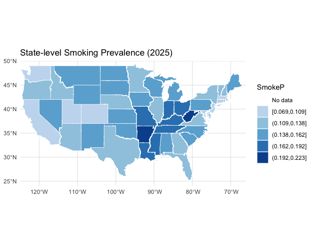
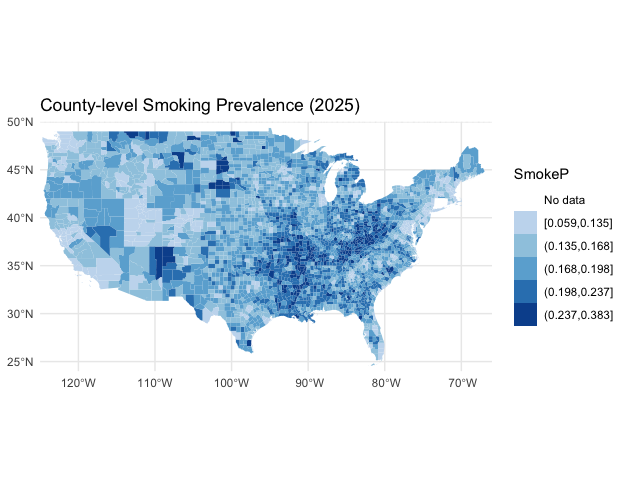

**Meta Data Name**: Smoking Population Variables  
**Date Added**: October 30, 2025  
**Author**: Yilin Lyu  
**Date Last Modified**: May 7, 2026  
**Last Modified By**: Yilin Lyu  

### Data Source(s) Description:  

#### Resources
Smoking prevalence variables were obtained from the County Health Rankings & Roadmaps (CHR&R) program, led by the University of Wisconsin Population Health Institute. County Health Rankings & Roadmaps compiles and curates population health indicators to highlight geographic differences in health outcomes and risk factors across U.S. communities, with an emphasis on health equity and the social determinants of health.

The smoking measure used in this dataset is derived from the Behavioral Risk Factor Surveillance System (BRFSS), a nationally representative health survey conducted by the Centers for Disease Control and Prevention (CDC).

Raw data were downloaded from the 2025 CHR CSV Analytic Data file [here](https://www.countyhealthrankings.org/health-data/methodology-and-sources/data-documentation). Additional documentation on data sources, methods, and historical measures is available through the County Health Rankings & Roadmaps documentation.

#### Geographic Boundaries
State and County boundary files were sourced from the [US Census Bureau, TIGER/Line Shapefiles 2018, 2020](https://www.census.gov/geographies/mapping-files/time-series/geo/carto-boundary-file.html). 
A copy of the geographic boundary files used can be found at the [HEROP GeoData Web Archive](https://geodata.healthyregions.org/).

### Description of Data Processing: 
The following variable was included from the source data:
* Percentage of smoking population

This measure was derived from the Behavioral Risk Factor Surveillance System (BRFSS). Adult smoking is the percentage of the adult population in a county who both report that they currently smoke every day or some days and have smoked at least 100 cigarettes in their lifetime.

State Map:

County Map:

### Data Limitations:
- The BRFSS only surveys adults (age 18 and older), lacking data on adolescent smoking. The Youth Behavioral Risk Factor Survey attempts to fill this gap, but it currently does not provide enough data to estimate county-level smoking prevalence among youth.
- BRFSS also currently only asks about the use of cigarettes and not e-cigarettes which have grown in prominence.
- Additionally, new methods using biomarkers have shown that not all smokers are exposed to the same level of contaminants. The simple “current smoker” status question does not capture the thousands of chemical compounds in cigarettes and cigarette smoke nor take into account the effects of secondhand smoke.

### Comments/Notes:
- This dataset includes the most recent year of 2025, please see the [Data & Documentation](https://www.countyhealthrankings.org/health-data/methodology-and-sources/data-documentation) provided by CHR&R for data before that.
- Smoking data are based not only on survey response, but depend on statistical modeling techniques that improve the precision of the estimates. Detailed information about key measure methods can be found [here](https://www.countyhealthrankings.org/health-data/community-conditions/health-infrastructure/health-promotion-and-harm-reduction/adult-smoking?year=2025).
